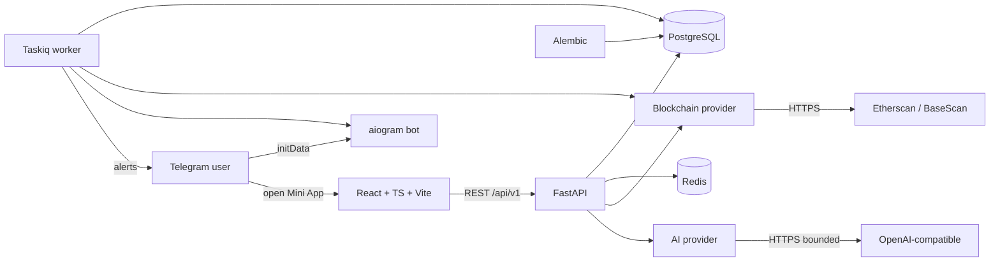

# Crypto Intelligence Platform

A read-only crypto wallet intelligence, monitoring, and alerting platform
shipped as a Telegram Mini App. Users add public blockchain wallet addresses
and receive portfolio summaries, transaction analysis, configurable alerts, and
AI-generated explanations of wallet activity — all without ever exposing a
private key.

> **Read-only by design.** The platform never requests, stores, transmits, or
> processes private keys, seed phrases, recovery phrases, or wallet passwords.
> It does not sign transactions, trade, or interact with wallets beyond
> reading public on-chain data.

## Key features

- Telegram Mini App with cryptographic initData authentication
- Watched wallets on EVM chains (Ethereum, Base) with EIP-55 normalization
- Native balance + token holdings + recent transactions
- Portfolio snapshots (point-in-time historical views)
- Configurable alerts (incoming/outgoing above threshold, activity, token transfer)
- Telegram notifications for fired alerts
- AI-generated wallet explanations with strict input/output boundaries
- Transaction risk indicators (low / medium / high) derived from on-chain facts
- Background workers with idempotent, retryable tasks
- Production-grade FastAPI backend with strict typing and security boundaries

## Architecture



The repository is a clean monorepo:

```
apps/
  api/        FastAPI app + Alembic migrations + tests
  bot/        aiogram 3.x Telegram bot
  web/        React + TypeScript + Vite Mini App
  worker/     Taskiq-style in-process worker (swappable for Redis broker)
packages/
  shared/     Normalized domain types (Chain, ParsedTx, WalletBalance, ...)
infra/        Dockerfiles, nginx config
.github/      CI pipeline
```

## Technology stack

**Backend:** Python 3.12, FastAPI, Pydantic v2, pydantic-settings, SQLAlchemy
2.x async, Alembic, asyncpg, Redis, httpx, aiogram 3.x, structured logging.

**Frontend:** React 18, TypeScript 5, Vite 5, TanStack Query 5, Tailwind CSS 3,
Telegram WebApp SDK integration.

**Infrastructure:** Docker (multi-stage, non-root), PostgreSQL 16, Redis 7,
nginx for static frontend serving + reverse proxy to the API.

## Security model

- **Identity is established exclusively from cryptographically verified Telegram
  initData.** The backend never trusts frontend-supplied Telegram user IDs.
- **Sessions** are short-lived HMAC-signed tokens; only the SHA-256 hash is
  stored server-side. Tokens are never logged.
- **Authorization** is enforced at every endpoint that operates on a wallet,
  alert, transaction, or analysis object. Cross-user access returns 404 (no
  existence leak).
- **SSRF protection** for outbound requests: HTTPS only, no credentials in
  URLs, no loopback / private / link-local ranges, no redirects followed.
- **AI prompt boundary:** user-controlled text is treated as untrusted data,
  encoded as JSON inside the user prompt, never as instructions. System prompt
  forbids URLs, code, and commands. Output is sanitized (URLs stripped,
  control chars removed, length-bounded).
- **No secrets in the repository.** `.env.example` contains only variable
  names and safe placeholders.
- **Production hardening:** `APP_SECRET` ≥ 32 chars, mock providers rejected,
  wildcard CORS rejected, `DEV_BYPASS_AUTH` forbidden.

## Supported functionality

| Capability                          | Status                                  |
| ----------------------------------- | --------------------------------------- |
| Telegram initData verification      | Implemented + tested                    |
| Add EVM wallet (Ethereum, Base)     | Implemented (EIP-55 checksum)           |
| Native balance fetch (Etherscan)    | Implemented (requires `BLOCKCHAIN_API_KEY`) |
| Token holdings fetch (Etherscan)    | Implemented (requires `BLOCKCHAIN_API_KEY`) |
| Recent transactions (Etherscan)     | Implemented (requires `BLOCKCHAIN_API_KEY`) |
| Mock provider (for local dev/tests) | Implemented                             |
| Portfolio snapshots                 | Implemented                             |
| Alerts (5 kinds) + Telegram notify  | Implemented + idempotent delivery       |
| AI explanation (wallet / tx)        | Implemented (mock + OpenAI providers)   |
| Risk indicators                     | Implemented (low / medium / high)       |
| React Mini App dashboard            | Implemented                             |

If a credential is unavailable, the integration falls back to a deterministic
mock provider. Real external calls are never faked.

## Setup

### Prerequisites

- Docker 24+ and Docker Compose v2 (recommended)
- Or: Python 3.12+, Node 20+, PostgreSQL 16, Redis 7 for local development

### Quick start with Docker

```bash
cp .env.example .env            # fill in TELEGRAM_BOT_TOKEN, BLOCKCHAIN_API_KEY, etc.
docker compose up -d db redis   # start infra
docker compose --profile migrate run --rm migrate  # apply migrations
docker compose up -d api worker web
docker compose --profile bot up -d bot   # optional: long-polling Telegram bot
```

- API: <http://localhost:8000> (docs at `/docs` in non-production)
- Web: <http://localhost:5173>
- Health: `GET /api/v1/health/live` and `GET /api/v1/health/ready`

### Local development

```bash
# Backend
python -m venv .venv && source .venv/bin/activate
pip install -e packages/shared -e .[dev]
alembic upgrade head
uvicorn apps.api.app.main:app --reload --port 8000

# Worker (separate terminal)
python -m apps.worker.worker.run_worker

# Bot (separate terminal)
python -m apps.bot.bot.main

# Frontend (separate terminal)
cd apps/web
npm ci
npm run dev
```

## Environment configuration

All variables are documented in `.env.example`. The most important:

| Variable                | Purpose                                              |
| ----------------------- | --------------------------------------------------- |
| `TELEGRAM_BOT_TOKEN`    | Bot token from @BotFather (required in production)  |
| `APP_SECRET`            | HMAC secret for session tokens (≥32 chars in prod)  |
| `DATABASE_URL`          | Async SQLAlchemy URL                                |
| `REDIS_URL`             | Redis URL for broker + caching                      |
| `BLOCKCHAIN_PROVIDER`   | `etherscan` or `mock`                                |
| `BLOCKCHAIN_API_KEY`    | Etherscan API key (required when provider=etherscan)|
| `AI_PROVIDER`           | `openai` or `mock`                                   |
| `AI_API_KEY`            | OpenAI-compatible API key (required when provider=openai) |
| `CORS_ORIGINS`          | Comma-separated allowed origins (no wildcard in prod)|
| `ENVIRONMENT`           | `development` / `staging` / `production`            |

The app fails fast on missing required production configuration.

## Development commands

```bash
# Backend
ruff format apps packages
ruff check apps packages
mypy apps/api/app apps/worker/worker apps/bot/bot packages/shared/shared
pytest apps/api/tests -ra
alembic upgrade head
alembic revision --autogenerate -m "describe change"

# Frontend
cd apps/web
npm run lint
npm run typecheck
npm run test
npm run build
```

## Tests

Backend (86 tests): address validation, EIP-55 normalization, Telegram
initData verification (valid/invalid/tampered/expired/malformed), session
token issuance and verification, settings validation (production constraints),
URL/SSRF safety, HTTP retry classification, alert evaluation idempotency,
worker sync idempotency, AI prompt injection resistance, output sanitization,
API integration (CRUD + IDOR + pagination + auth required).

Frontend (9 tests): format helpers, wallet form validation (rejects invalid
addresses, accepts valid, renders backend errors).

External API calls are never required: tests use a deterministic mock
provider and an in-memory SQLite database.

## Project structure

```
.
├── apps/
│   ├── api/                  # FastAPI app
│   │   ├── app/
│   │   │   ├── api/v1/       # Routers (auth, wallets, alerts, ai, health)
│   │   │   ├── ai/           # AI provider abstraction + prompt builder
│   │   │   ├── alembic/      # Migration env + versions
│   │   │   ├── core/         # config, logging, errors
│   │   │   ├── db/           # async engine + session factory
│   │   │   ├── models/       # SQLAlchemy ORM models
│   │   │   ├── providers/    # Blockchain providers (etherscan, mock)
│   │   │   ├── schemas/      # Pydantic v2 DTOs
│   │   │   ├── security/     # Telegram initData verification + sessions
│   │   │   ├── services/     # Business logic (wallets, alerts, AI)
│   │   │   ├── utils/        # addresses, http_retry, url_safety
│   │   │   └── main.py
│   │   └── tests/            # 86 backend tests
│   ├── bot/                  # aiogram 3.x Telegram bot
│   ├── web/                  # React + TypeScript Mini App
│   └── worker/               # In-process worker (Taskiq-compatible)
├── packages/
│   └── shared/               # Normalized domain types (py.typed)
├── infra/                    # Dockerfiles + nginx config
├── .github/workflows/ci.yml  # CI: ruff, mypy, pytest, eslint, tsc, vitest, vite build
├── alembic.ini
├── compose.yaml
├── pyproject.toml
├── .env.example
├── .gitignore
├── .dockerignore
└── README.md
```

## Limitations

- The shipped worker uses an in-process broker (sufficient for a single
  process; production deployments should switch to TaskiqRedisBroker — the
  task signatures are unchanged).
- Etherscan token holdings are derived from `tokentx` transfer history (no
  direct ERC-20 balanceOf call); this is the API's standard pattern.
- Pricing is not fetched: `native_usd` and `tokens_usd` are populated only
  when the provider returns a price. Adding a price oracle is a documented
  extension point in the provider protocol.
- No live demo is provided; do not infer one from this README.
- No real production deployment is claimed.

## License

MIT — see [LICENSE](LICENSE).
